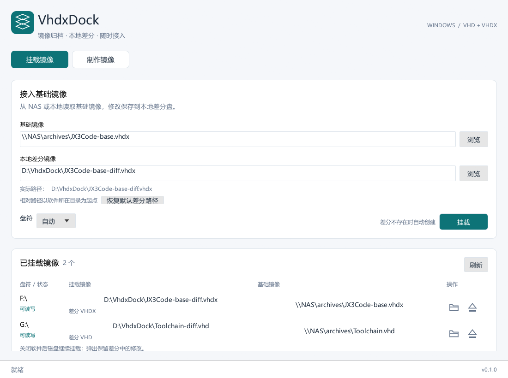
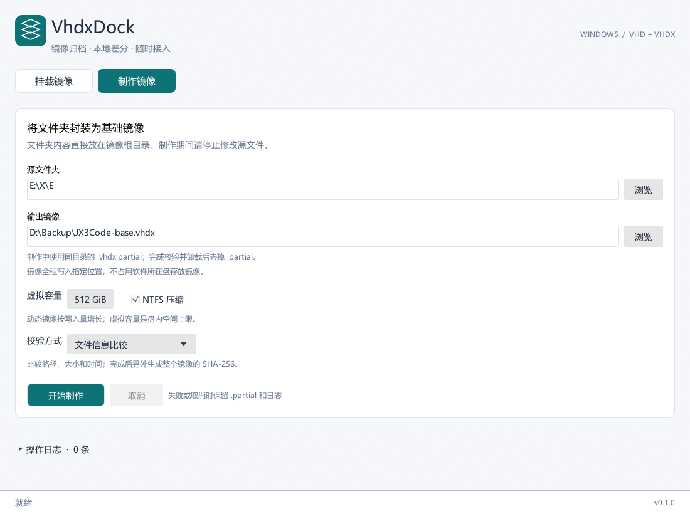
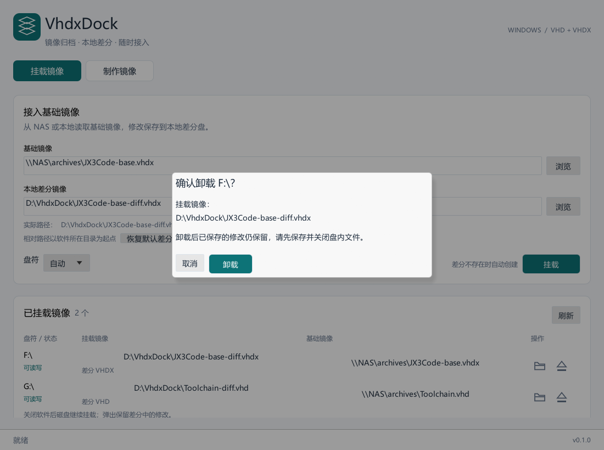

# VhdxDock

Windows 便携式 VHDX 镜像制作与 VHD/VHDX 差分挂载工具。

将文件夹封装为单个基础镜像；基础镜像可以保存在 NAS，本地差分盘承接所有修改。挂载后作为普通 Windows 磁盘使用，卸载、重新挂载后修改仍然保留。

> 开发预览版本。自动化测试只使用临时小镜像；实际 NAS 的 SMB、权限、断线行为需要在你的环境验证。请保留原数据，完成备份校验后再决定是否清理。

## 界面预览

以下截图由应用自身渲染，使用示例路径和磁盘数据：





## 功能

- **挂载**：基础镜像、本地差分两条路径；差分不存在自动创建，存在则验证父链后复用。
- **格式**：挂载 VHD / VHDX，新制作统一输出动态 VHDX。
- **多磁盘管理**：从 Windows 查询已挂载镜像，每行提供打开和弹出图标；弹出必须二次确认，繁忙卷拒绝卸载。
- **制作**：源目录内容直接放进镜像根目录，包括隐藏文件、`.git`、空目录，链接按链接保留。
- **压缩**：GPT + NTFS，默认开启镜像内部 NTFS 压缩。
- **校验**：默认文件信息比较，可选逐文件 SHA-256；完成后额外生成整个镜像的 `.sha256` 文件。
- **父路径迁移**：验证镜像身份后，将已有差分重新关联到搬迁后的 base。
- **后台任务**：制作、扫描、校验和磁盘操作不会阻塞界面，支持取消制作、查看日志和记忆配置。

## 获取与运行

在 [Actions](https://github.com/tinymins/vhdxdock/actions) 的成功 Windows 构建中下载 `VhdxDock-windows-x64`，解压到本地可写目录，运行 `VhdxDock.exe`。

- Windows 10 / 11 x64；依赖系统内置 PowerShell 5.1、Storage 模块和 Robocopy。
- 启动时请求管理员权限。取消授权后退出。
- 无需第三方镜像驱动或 Hyper-V PowerShell 模块。
- 中文字体从 Windows 字体目录读取，不附带第三方商业字体。

## 挂载 NAS 镜像

1. 基础镜像填 `\\NAS\backup\JX3Code-base.vhdx`，推荐使用 UNC 地址而不是映射盘符。
2. 差分默认 `.\JX3Code-base-diff.vhdx`，也可选择如 `D:\Diff\JX3Code-diff.vhdx`。
3. 选择自动或指定盘符，点击 **挂载**。
4. 在下方列表点击文件夹图标打开磁盘，点击弹出图标并确认后卸载。

所有相对路径固定相对于 **exe 所在目录**；界面显示实际绝对路径。差分必须放本地，大小会随修改增加。如果 exe 在 C 盘而希望写入 D 盘，请修改差分路径。

差分仅保存变化，**不能脱离基础镜像使用**。卸载不会丢弃修改；关闭工具窗口也不会卸载已挂载磁盘。基础镜像在被差分依赖后必须保持原样，不要直接写入、合并、替换或重建。NAS 权限和 Windows 凭据由系统管理，本工具不保存密码。

## 制作文件夹镜像

填写源文件夹和一个输出镜像路径，选择虚拟容量（默认 512 GiB）、压缩和校验方式，然后开始制作。制作期间请停止修改源目录；一期不提供 VSS 在线快照。

例如源 `E:\X\E`，输出 `D:\Backup\XE-base.vhdx`：

```text
E:\X\E\Base        → 镜像根目录\Base
E:\X\E\DevEnv      → 镜像根目录\DevEnv

制作中：D:\Backup\XE-base.vhdx.partial
完成后：D:\Backup\XE-base.vhdx
校验值：D:\Backup\XE-base.vhdx.sha256
```

镜像数据全程写在选定输出目录，**不会缓存到 C 盘**，完成改名也不复制第二份镜像。NAS 输出采用相同流程，直接写到 NAS。

虚拟容量是挂载后磁盘的容量上限，动态镜像按实际写入量增长；内部压缩率取决于文件内容。工具会按未压缩数据加文件系统预留检查空间，不把预期压缩率当作空间保证。

默认校验比较文件信息，**不是逐字节内容校验**。重要归档可以选逐文件 SHA-256。符号链接和目录联接保存链接本身，外部目标数据不会被归档。文件内容、属性和时间戳会复制；不复制源所有者、ACL 和审计权限。

已有最终镜像、`.partial` 或同名校验文件时停止，不自动覆盖。失败或取消会保留未完成文件与日志，并尝试卸载本次制作的镜像；格式化等不可中断阶段会先结束，再取消清理。一期不支持断点续制。

可在管理员 PowerShell 检查镜像文件哈希：

```powershell
Get-FileHash -LiteralPath 'D:\Backup\XE-base.vhdx' -Algorithm SHA256
```

## 移动基础镜像

最简单的方式是先把 base 放到 NAS 最终位置，再创建本地差分。如果差分已存在：先卸载，通过挂载页的 **重新定位基础镜像** 选择差分和新 base。工具验证父链身份，拒绝强行忽略不匹配。

相同文件名不代表相同父镜像。搬迁副本建议先核对完整 SHA-256；工具不会每次挂载读取几十 GB 计算哈希。VHDX 父链由 Windows 在打开时进一步验证。

## 配置与日志

优先保存到 exe 目录的 `config.json` 和 `logs/`；目录不可写时使用用户应用数据目录。制作日志包含扫描结果、链接、复制、复查和最终校验信息。不会在日志中保存 NAS 密码。

## 从源码构建

安装 Rust stable 和 Visual Studio C++ Build Tools（MSVC、Windows SDK）：

```powershell
git clone https://github.com/tinymins/vhdxdock.git
cd vhdxdock
powershell -NoProfile -ExecutionPolicy Bypass -File .\scripts\build-windows.ps1 -Release
```

输出 `dist\VhdxDock.exe`。如果源码位于 WSL UNC 路径，给 Cargo 指定本地构建目录，避免 UNC 文件锁限制：

```powershell
powershell -NoProfile -ExecutionPolicy Bypass -File .\scripts\build-windows.ps1 -Release -TargetDir D:\Build\VhdxDock
```

验证：

```powershell
cargo fmt --all -- --check
cargo clippy --locked --all-targets -- -D warnings
cargo test --locked --all-targets
```

真实磁盘集成测试默认忽略，仅在管理员会话、显式设置测试开关后运行；只创建并操作专用临时目录中的测试镜像：

```powershell
$env:VHDXDOCK_RUN_DISK_TESTS = '1'
cargo test --locked --test windows_disks --test windows_builder -- --ignored --test-threads=1
```

## 技术与范围

Rust + egui/eframe；原生 VirtDisk API 管理镜像；Storage PowerShell 管理新虚拟磁盘分区；Robocopy 复制文件。

一期不支持 ISO、QCOW2、VMDK、SquashFS、镜像转换、合并回父盘、差分重置或开机自动挂载。

## License

MIT
